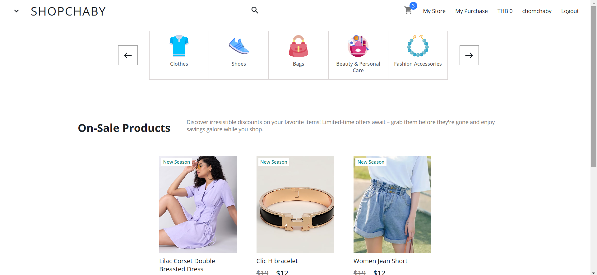
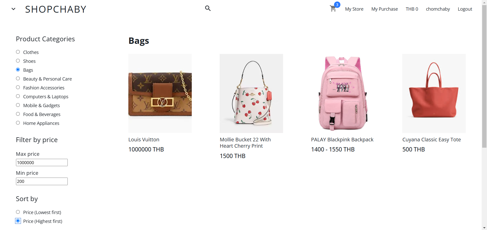
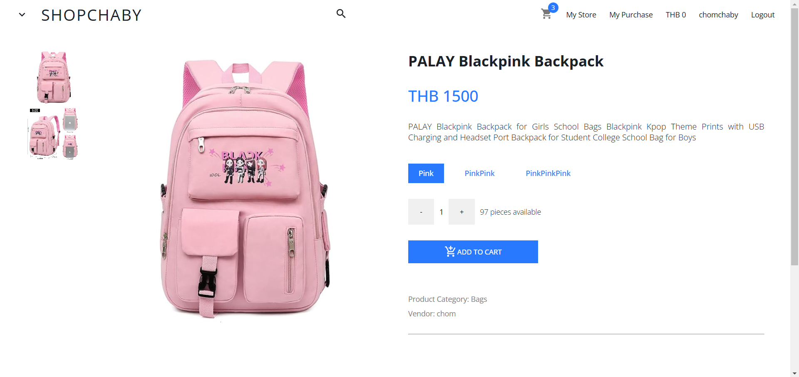
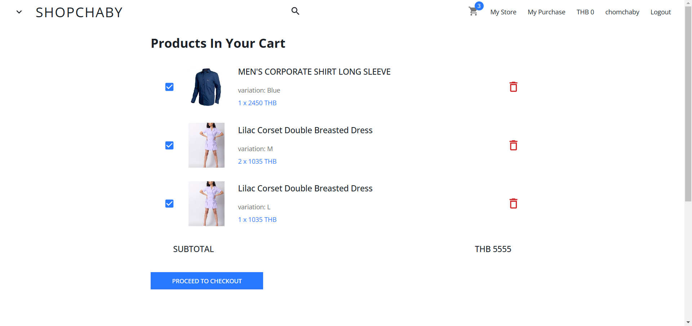
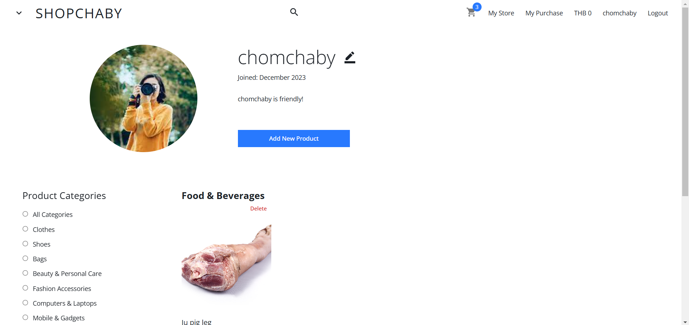

# ShopChaby - E-commerce Website

**ShopChaby** is an e-commerce platform where users can both buy and sell products. After logging in, each user can create their own store, much like how YouTube allows users to have their own channels. This is my first web development project, and I used a variety of tools and technologies to build it, learning along the way.

## Features

- **User Accounts**: Users can sign up, log in, and manage their accounts.
- **Seller & Buyer Roles**: Every user can act as both a seller and a buyer.
- **Store Creation**: Each user can create and manage their own store.
- **Product Listings**: Sellers can add, update, and delete product listings.
- **Shopping Cart**: Buyers can add products to their shopping cart and proceed to checkout.
- **JWT Authentication**: Secure login and session management using JSON Web Tokens.

## Technologies Used

- **Frontend**:
  - React.js for building the user interface.
  - Material-UI (MUI) for UI components.
  - Axios for making HTTP requests to the backend.

- **Backend**:
  - Flask (Python) for the backend server.
  - MySQL for the database.
  - SQLAlchemy for Object-Relational Mapping (ORM).
  - JWT (JSON Web Token) for authentication and session management.

## ER Diagram

Below is the ER diagram that shows the database structure for the project. It includes tables for users, stores, products, and transactions.

  

## UI/UX Design

I designed the user interface and experience myself, focusing on creating a clean, intuitive design that is easy to navigate. The goal is to provide a smooth shopping and selling experience for users, from logging in to browsing products and managing their stores. Here are some screenshots of the current design:

  

## Future Work

- **Third-Party Authentication**: Implement third-party authentication (e.g., Google login).
- **Buying Process**: Complete the buying process, which is currently not functional.
- **On-Sale System**: Finalize the "on sale" system, allowing products to be marked as on sale.
- **History System**: Implement a history system to track user activity and past transactions.
- **Text-Based Search System**: Implement a text search functionality, allowing users to search for products by name, description, or other relevant text fields, in addition to the existing filter options.

## View the Live Version

_(This project is still under development. The website is not yet deployed.)_